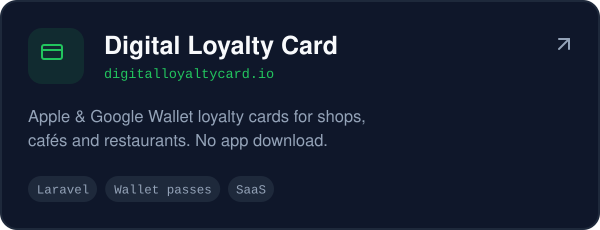
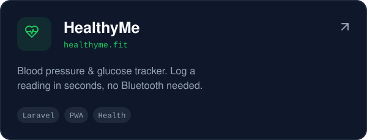
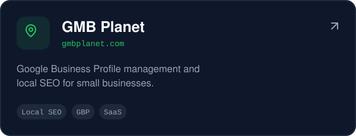
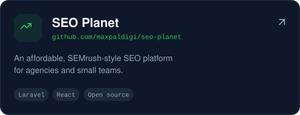
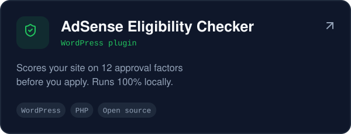
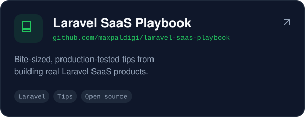
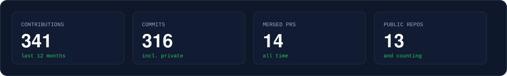

  
  
  
  

## What I build

Products I've designed, built and run for small businesses.

  
  
  
  

## Open source

  
  

Also: [Loyalty ROI Calculator](https://github.com/maxpaldigi/loyalty-roi-calculator) · [Portugal Admission Guide](https://github.com/Suprimtamang/portugal-admission-guide) with [@Suprimtamang](https://github.com/Suprimtamang)

## Stack

## Activity

---

Open to collaborations on SaaS, local SEO and web projects. Say hi at <a href="mailto:maxpal1234@gmail.com">maxpal1234@gmail.com</a>.
